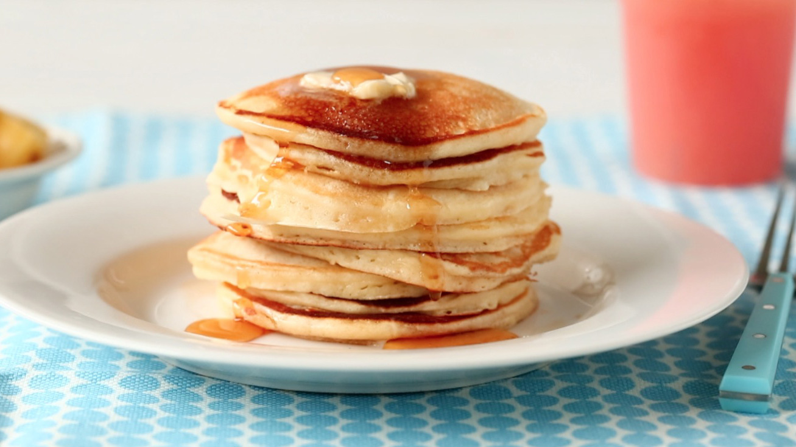

# Pancake

#INGREDIENTS
- 1 ½ cups all-purpose flour
- 3 ½ teaspoons baking powder
- ¼ teaspoon salt, or more to taste
- 1 tablespoon white sugar
- 1 ¼ cups milk
- 1 egg
- 3 tablespoons butter, melted
#END INGREDIENTS

## Process
- In a large bowl, sift together the flour, baking powder, salt and sugar. Make a well in the center and pour in the milk, egg and melted butter; mix until smooth.
- Heat a lightly oiled griddle or frying pan over medium-high heat. Pour or scoop the batter onto the griddle, using approximately 1/4 cup for each pancake. Brown on both sides and serve hot.

